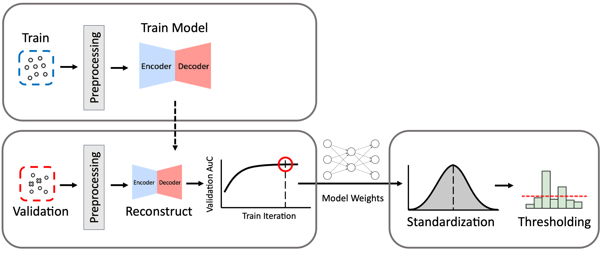

# SystematicAEIDS
* Analysis of Autoencoders for Network Intrusion Detection (Sensors 2021)
* Systematic Approach to Building Autoencoder-based IDS (SVCC 2020)

Analysis of AE model design for IDS
* Model Structure
    + Size of hidden layers
    + Number of hidden layers
* Latent Size

Plot how MCC, TPR changes as latent size increases for each Model Structure

## Approach
### System Overview


### Performance Metrics
* Accuracy, Precision, Recall (TPR), F-score
* Recall (TPR), False Positive Rate (FPR)
* Matthews Correlation Coefficient (MCC)
* Area Under the Curve (AUC) of Receiver Operator Characteristic (ROC) Curve

## Dataset
* NSL-KDD
* IoTID20
    + https://sites.google.com/view/iot-network-intrusion-dataset/home
* N-BaIoT
    + https://archive.ics.uci.edu/ml/datasets/detection_of_IoT_botnet_attacks_N_BaIoT#
    + Danmini_Doorbell, Ecobee_Thermostat, Provision PT-737E, SimpleHome XCS7 1002, Philips Baby Monitor

### Preprocessing
MinMax Scaling for numerical, OneHot encoding for categorical features

## Evaluation
Parameters
```
train_nsl.py --epoch 100 --batch_size 512 --lr 1e-4 --num_layers 2 --l_dim 1
```
For num_layers 2 l_dim is checked in the range 1~31.

### IoTID20

### N-BaIoT


## Paper
Analysis of Autoencoders for Network Intrusion Detection
Youngrok Song, Sangwon Hyun, Yun-Gyung Cheong